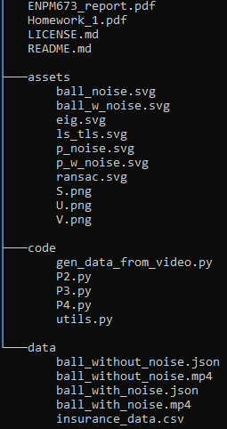

# ENPM673 HW 1
The directory structure of the repo is:

## Steps to run each file
Change current working directory to "code"
To generate data points from each video run the following command

    python3 gen_data_from_video.py
  To run the implementation of the pipeline for Problem 2, run the following command
  

    python3 P2.py
   To run the implementation of the pipeline for Problem 3, run the following command
  

    python3 P3.py
   To run the implementation of the pipeline for Problem 4, run the following command
  

    python3 P4.py
   